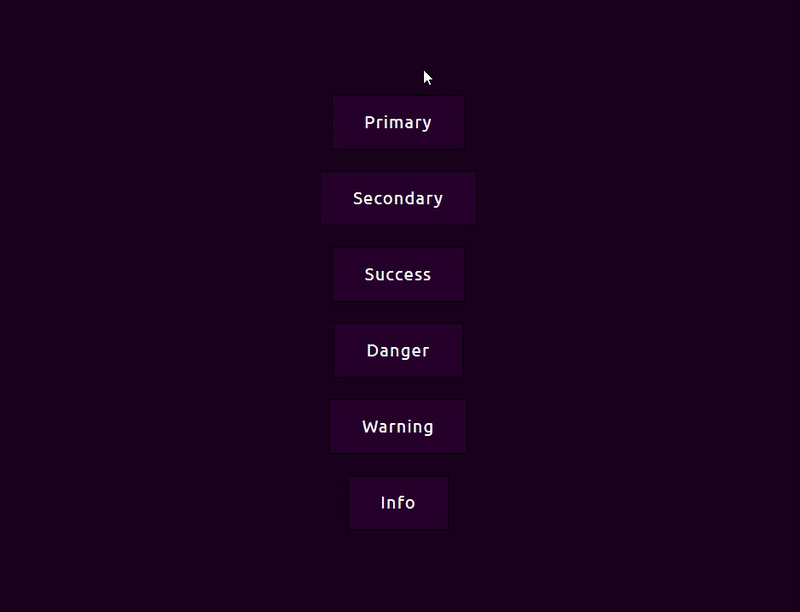

<h1 align="center">
    Shiny Buttons
</h1>

## 💻 Sobre o projeto
Projeto para praticar Transições, Gradientes Lineares e CSS em geral

## 🛠 Tecnologias/Ferramentas

As seguintes ferramentas foram usadas na construção do projeto:

-   HTML
-   Sass/CSS

## 🚀 Resultado

<h1 align="center">
    
</h1>

## 🦸 Autor

Desenvolvido por Douglas Rodrigues 👋🏽 [Entre em contato!](https://www.linkedin.com/in/douglas-rodrigues-pnz/)
